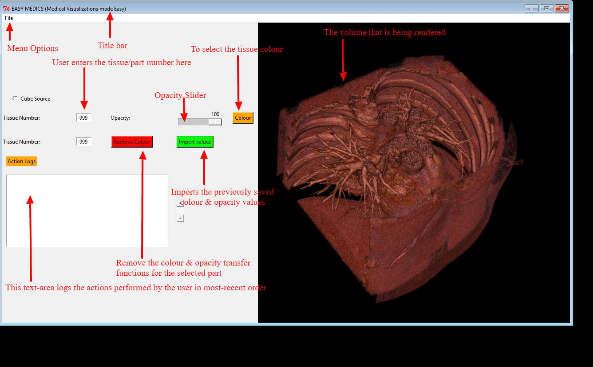
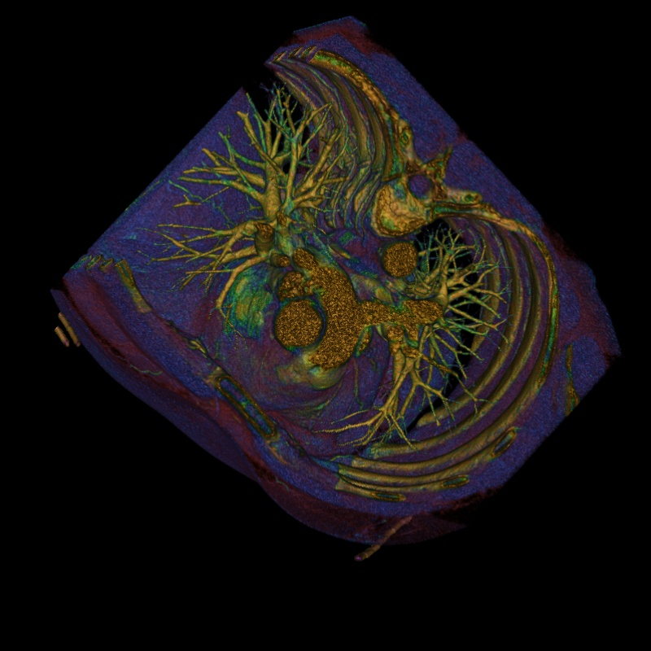

# EasyMedics
An easy to use Medical Image Analysis Tool.

## Try out your own colour & opacity transformation functions
### (a)

### (b)

* Pictures (a) and (b) were obtained using different sets of colour and opacity transformation functions *

# Features
1. Support Volume Rendering
2. add/modify color-transfer functions
3. add/modify opacity transfer functions
4. Feature to save the render screen after modification as JPEG
5. Writes the final color/opacity values as a text/file for reference.
6. Can load up color/opacity transfer functions from a file

This utility can be extended, to support different types of Images and Volumetric datasets.

# Format for saving the transformation functions, opacity & colours

# Want to contribute ?
There's still a lot of things that can be improved.
Looking for some ideas ?
See the Todo.MD, for the current bugs and features currently in pipeline
- Fork the repo and extend this utility your own custom features.
- Send me a pull request

#### Software Versions
1. Python 2.7
2. vtk 5.10.1
**(The latest versions i.e 7.0.0,  does not have good support for Tkinter)**

# Want to learn more about volume rendering ?
#### Volume Rendering
In scientific visualization and computer graphics, volume rendering is a set of techniques used to display a 2D projection of a 3D discretely sampled data set, typically a 3D scalar field.
Resources are as follows:
1. https://en.wikipedia.org/wiki/Volume_rendering
2. https://blog.kitware.com/volume-rendering-improvements-in-vtk/

#### Resource for Learning GUI programming with Tkinter:
1. Learning Tkinter : https://www.youtube.com/playlist?list=PL6gx4Cwl9DGBwibXFtPtflztSNPGuIB_d
2. VTK + Tkinter : https://www.evl.uic.edu/aspale/cs526/final/2-2-2.htm

# License

MIT License

Copyright (c) 2016 Shrobon Biswas

Permission is hereby granted, free of charge, to any person obtaining a copy of this software and associated documentation files (the "Software"), to deal in the Software without restriction, including without limitation the rights to use, copy, modify, merge, publish, distribute, sublicense, and/or sell copies of the Software, and to permit persons to whom the Software is furnished to do so, subject to the following conditions:

The above copyright notice and this permission notice shall be included in all copies or substantial portions of the Software.

THE SOFTWARE IS PROVIDED "AS IS", WITHOUT WARRANTY OF ANY KIND, EXPRESS OR IMPLIED, INCLUDING BUT NOT LIMITED TO THE WARRANTIES OF MERCHANTABILITY, FITNESS FOR A PARTICULAR PURPOSE AND NONINFRINGEMENT. IN NO EVENT SHALL THE AUTHORS OR COPYRIGHT HOLDERS BE LIABLE FOR ANY CLAIM, DAMAGES OR OTHER LIABILITY, WHETHER IN AN ACTION OF CONTRACT, TORT OR OTHERWISE, ARISING FROM, OUT OF OR IN CONNECTION WITH THE SOFTWARE OR THE USE OR OTHER DEALINGS IN THE SOFTWARE.
